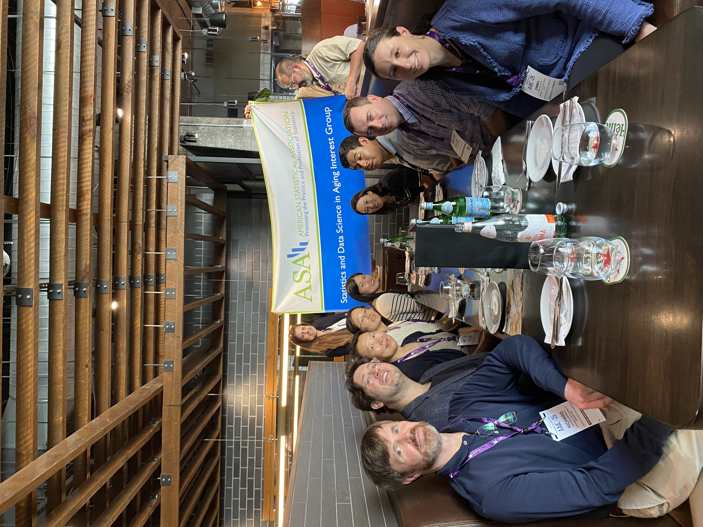
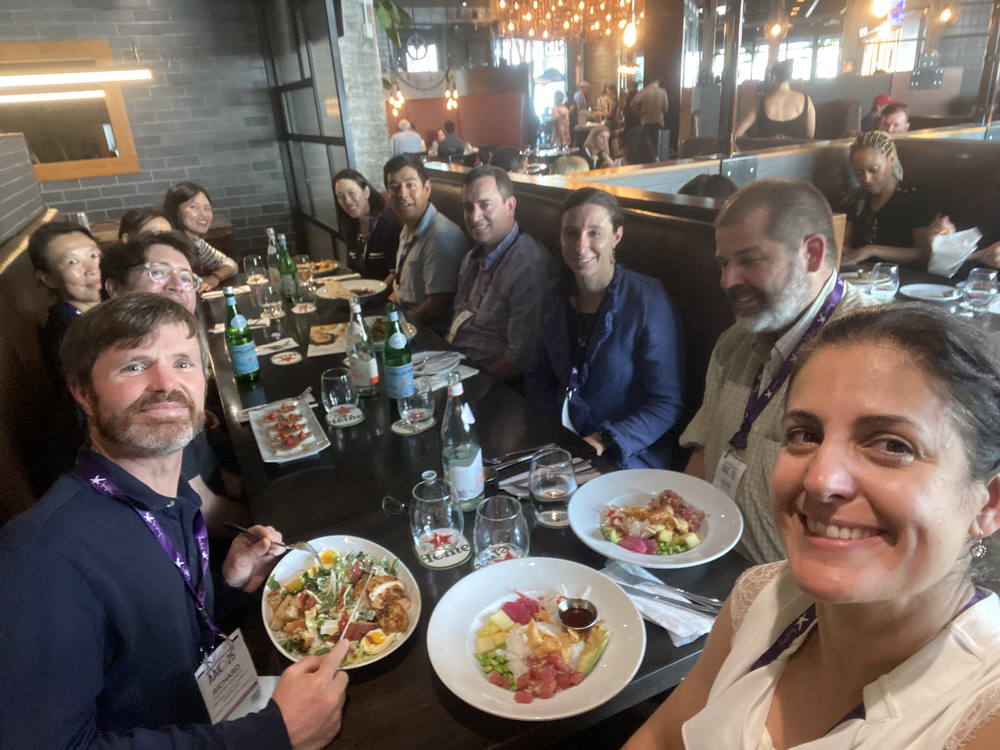
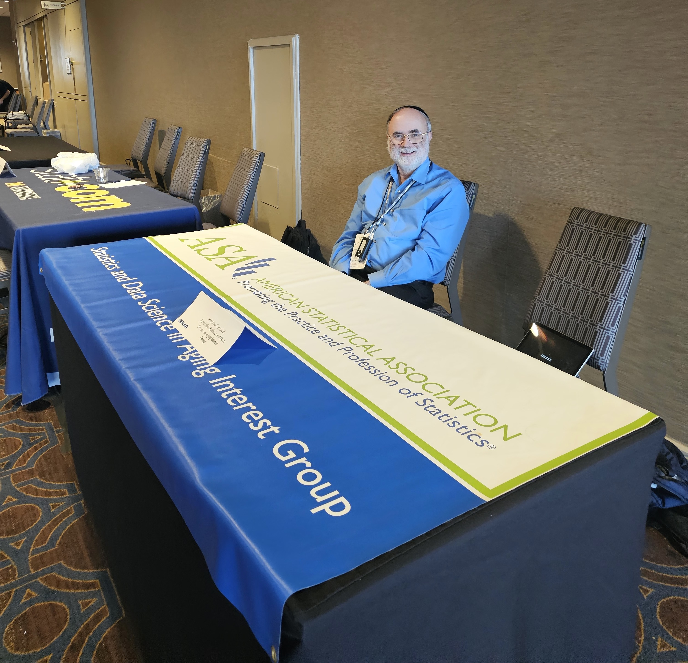
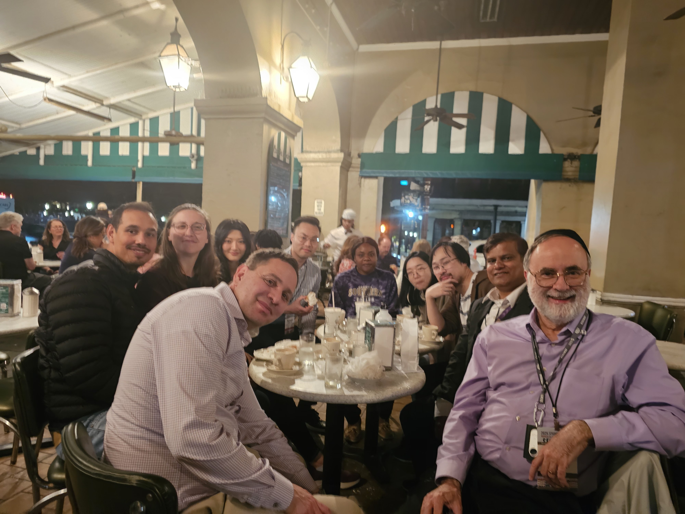

---
---

<h1> In person meetings </h1>

#### JSM Mixer (MHSS, HPSS and SDSA) (8/2/25-8/7/25)

* Joint meeting with  MHSS, HPSS and SDSA
* Time and Date: 6:00pm, 8/4/2025 (Monday)

<figure>
 
 
</figure>
  

### AAIC Lunch at Toronto (7/27/25-7/31/25)

* Time and Date: 7/29/25 (Tuesday), 12:15 pm
* Venue: [Kelly's landing](https://www.thelandinggroup.ca/en/menu/kellys/food.html) (Contact to Ana Capuano or Seonjoo Lee)
 

<figure>
 
 
</figure>
  

#### In person meeting at LiDS (5/28/25-5/30/25)

  
 Conference Booth at LiDS 

  Thank you, Charlie!

   
  
<figure>
 
</figure>
  

#### ENAR 2025 (Monday 3/24/25)

Conference Booth & Meetup at ENAR (the legendary Cafe Du Monde)

 
 

  
Details...

  
  

  We will have an information table and we will also be having a meetup on Monday night.

Our meetup will be Monday night and will be a walk to the legendary Cafe Du Monde,  a short walk from the conference hotel:
[Cafe Du Monde New Orleans](
https://nam02.safelinks.protection.outlook.com/?url=https%3A%2F%2Fshop.cafedumonde.com%2F&data=05%7C02%7Csl3670%40cumc.columbia.edu%7Ca22ee9b0e91c418e200508dd68791c03%7Cb0002a9b0017404d97dc3d3bab09be81%7C0%7C0%7C638781591563925228%7CUnknown%7CTWFpbGZsb3d8eyJFbXB0eU1hcGkiOnRydWUsIlYiOiIwLjAuMDAwMCIsIlAiOiJXaW4zMiIsIkFOIjoiTWFpbCIsIldUIjoyfQ%3D%3D%7C0%7C%7C%7C&sdata=gBByKbyc5Ptp7%2Fg6runaN0YGjtyPqgRj93SaZj%2BaHAI%3D&reserved=0).

The meeting is tentatively scheduling it for 830pm so that we can eat dinner beforehand, as Cafe Du Monde is not really a restaurant, but a coffee stand with beignets. Please RSVP to my email charles.hall@einsteinmed.edu again with "SDSA ENAR" in the subject field if you are planning to join us. 
  
  The Statistics and Data Science in Aging Interest Group will be at the International Biometric Society Eastern North American Region (ENAR) Meeting in New Orleans, March 23-26! We will have an information table and we will also be having a meetup on Monday night. Anyone attending who would like to take a shift please send me an email at charles.hall@einsteinmed.edu with "SDSA ENAR" in the subject heading. Our meetup will be Monday night and will be a walk to the legendary Cafe Du Monde,  a short walk from the conference hotel:
[Cafe Du Monde New Orleans](
https://nam02.safelinks.protection.outlook.com/?url=https%3A%2F%2Fshop.cafedumonde.com%2F&data=05%7C02%7Csl3670%40cumc.columbia.edu%7Ca22ee9b0e91c418e200508dd68791c03%7Cb0002a9b0017404d97dc3d3bab09be81%7C0%7C0%7C638781591563925228%7CUnknown%7CTWFpbGZsb3d8eyJFbXB0eU1hcGkiOnRydWUsIlYiOiIwLjAuMDAwMCIsIlAiOiJXaW4zMiIsIkFOIjoiTWFpbCIsIldUIjoyfQ%3D%3D%7C0%7C%7C%7C&sdata=gBByKbyc5Ptp7%2Fg6runaN0YGjtyPqgRj93SaZj%2BaHAI%3D&reserved=0). The meeting is tentatively scheduling it for 830pm so that we can eat dinner beforehand, as Cafe Du Monde is not really a restaurant, but a coffee stand with beignets. Please RSVP to my email charles.hall@einsteinmed.edu again with "SDSA ENAR" in the subject field if you are planning to join us. Looking forward to seeing many of you there!

 

#### MSRD Business meeting at GSA (Saturday November 16 2-3:15pm)
* If you are attending the GSA Annual Meeting in Seattle next month, please attend the MSRD Business Meeting, which will feature a joint SDSA-MSRD panel discussion on grant writing.
 
* MSRD Business meeting time/location: Saturday November 16 2-3:15pm, Room Location: 3B

  
Details...

* Grant Writing Panelists:
- Dr. Jonathan King (NIA program officer)
- Dr. Alden Gross, JHU  (NIA R01 MPI/PI awardee, R13 awardee)
- Dr. Yong-Fang Kuo, UMTB (NIA R01 MPI/PI awardee, P30 core awardee)
- Dr. Chixiang Chen, U Maryland, Baltimore (NIA R01 awardee, Pepper pilot and ATIP awardee)
- Dr. Samaneh Farsijani, U Pitt (NIA K01 awardee, R01 applicant)
 
- Moderator: Dr. Michelle Shardell, U Maryland Baltimore

 
