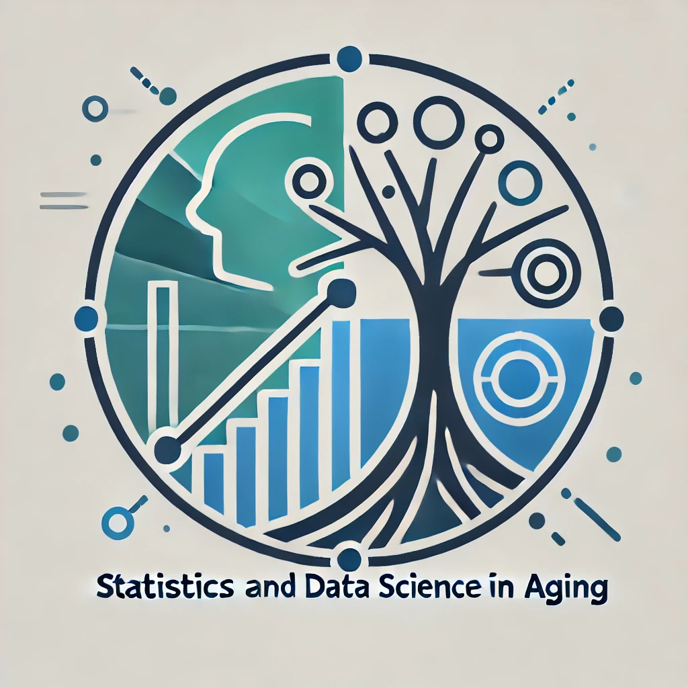

---
title:
output:
  html_document:
    df_print: paged
---

<h1 style="background-color:LightCyan;text-align:center;font-family:'Comic Sans MS';color:RoyalBlue;">Welcome to the Statistics and Data Science in Aging Interest Group!</h1>

<p>

 

</p>

### Join the SDSA

<p> Click [here](https://form.jotform.com/zzlalo/friends-of-sdsa) to join SDSA! (Welcome to our new members 😊!)</p>

<details>
  <summary>Details...</summary>
<embed src="files/SDSA flyer v2.pdf#toolbar=0" width="600px" height="800px"
    scrolling="auto"/>
</details>

<br>


### Fall 2025 - Spring 2026 SDSA Webinars

```{r, echo = FALSE, message = FALSE, warning = FALSE }
library(tidyverse)
library(knitr)
library(kableExtra)
```


```{r, echo = FALSE, message = FALSE, warning = FALSE }
dt_url <- c(
  "https://amstat.zoom.us/webinar/register/WN_jYW2t5DBQW6amFZlsJZOng#/registration",
  "https://amstat.zoom.us/webinar/register/WN_-QrTGG2tS7yKXREkiJn6-Q"
            )

tib = tibble(
  `Date` = c(
    "9/25/2025",
    "10/23/2025"
  ),
    `Time` = c(
    "4-5pm ET/3-4pm CT/2-3pm MT/1-2pm PT",
    "noon-1pm ET/11am-noon CT/10-11am MT/9-10am PT"  ),
  `Speaker` = c(
    "Paola Sebastiani, PhD, Professor of Medicine, Tufts University School of Medicine",
    "Liam Messin, Deputy Editor for Nature Medicine & Sebastien Thuault Chief Editor of Nature Aging"
  ),
  `Title` = c(
    "Metabolite Signatures of Chronological Age, Aging, Survival and Longevity",
    "Aging research at Nature Aging and Nature Medicine"
    
  ),
  `Registration/talk links` = c(
     "Registration",
    "Registration"
    )
)

kable(tib[nrow(tib):1,], row.names = FALSE) %>%
  kable_styling(bootstrap_options = "striped",font_size = 15, repeat_header_method = "replace") %>%
  column_spec(1, width = ".5cm") %>%
  column_spec(2, width = "2cm") %>%
  column_spec(3, width = "4cm") %>%
  column_spec(4, width = "5cm")%>%
  column_spec(5, width = ".5cm",link = dt_url[nrow(tib):1])
```


### ARISE – Fall 2025 Webinar Series

* ARISE: Aging Research – Innovations in Statistical Exploration

<details>
  <summary>Detailed information for titles and speakers</summary>
<embed src="files/ARISE - Schedule Fall 2025_updated.pdf#toolbar=0" width="600px" height="800px"
    scrolling="auto"/>
</details>
<br>


```{r, echo = FALSE, message = FALSE, warning = FALSE }
dt_url <- c("https://amstat.zoom.us/j/84186505606?pwd=pMZ4DV1KkIbK3Jd0G6EnBUsAFebtiD.1",
            "https://amstat.zoom.us/j/84186505606?pwd=pMZ4DV1KkIbK3Jd0G6EnBUsAFebtiD.1",
            "https://amstat.zoom.us/j/84186505606?pwd=pMZ4DV1KkIbK3Jd0G6EnBUsAFebtiD.1",
            "https://amstat.zoom.us/j/84186505606?pwd=pMZ4DV1KkIbK3Jd0G6EnBUsAFebtiD.1")

tib = tibble(
  `Date` = c(
    "8/27/2025",
    "9/8/2025",
    "10/29/2025",
    "11/3/2025"
  ),
    `Time` = c(
    "1-2pm ET/12-1pm CT/11am-12pm MT/10-11am PT",
    "12-1pm ET/11am-12pm CT;10-11am MT/9-10am PT",
    "1-2pm ET/12-1pm CT/11am-12pm MT/10-11am PT",
    "12-1pm ET/11am-12pm CT;10-11am MT/9-10am PT"
  ),
  `Speaker` = c(
    "Tianying Wang, PhD; Owen Li, PhD Student; Molly Ehrig, MS",
    "Pulkit Khandelwal, PhD; Boyi Hu, PhD Candidate; Julia Gallini, PhD Candidate",
    "Xuexin Yu, PhD; Margaret Gacheru, PhD; Matthew R. Scott, PhD Candidate",
    "Jiachen Chen, PhD Candidate; Alessandra Pescina, MS; Deependra Kaji Thapa, PhD"
     ),
#  `Title` = c("","","",""
#     ),
  `Registration/talk links` = c(
    "Zoom",
    "Zoom",
    "Zoom",
    "Zoom"
   )
)

kable(tib, row.names = FALSE) %>%
  kable_styling(bootstrap_options = "striped",font_size = 15, repeat_header_method = "replace") %>%
  column_spec(1, width = ".5cm") %>%
  column_spec(2, width = "2cm") %>%
  column_spec(3, width = "4cm") %>%
#  column_spec(4, width = "5cm")%>%
  column_spec(4, width = ".5cm",link = dt_url[nrow(tib):1])
```
