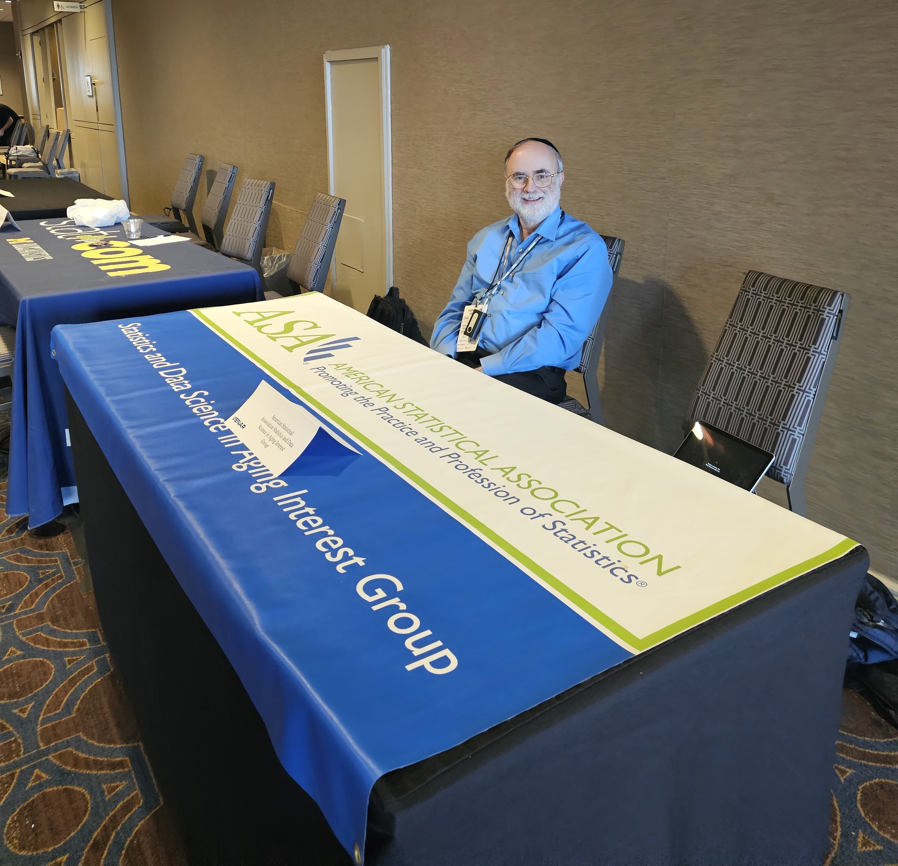

---
---

<h1> Webinars </h1>

## Fall 2024

```{r, echo = FALSE, message = FALSE, warning = FALSE }
library(tidyverse)
library(knitr)
library(kableExtra)
```

### SDSA Webinars


```{r, echo = FALSE, message = FALSE, warning = FALSE }
dt_url <- c("https://youtu.be/-jJwOjizPtU",
            "https://www.youtube.com/watch?v=dw74CQJZ3v0",
            "https://www.youtube.com/watch?v=rWAeVmjyorQ",
            "https://youtu.be/N578BcxJ0yM",
            "https://youtu.be/xoRSS12b0mU",
            "https://youtu.be/XroGLWF0EzI")

tib = tibble(
  `Date` = c(
    "9/30/2024",
    "10/29/2024",
    "01/13/2025",
    "02/27/2025",
    "03/26/2025",
    "05/08/2025"
  ),
    `Time` = c(
    "1-2pm ET/12-1pm CT/11am-12pm MT/10-11am PT",
    "2-3pm ET/1-2pm CT;12-1pm MT/11am-12pm PT",
    "1-2pm ET/12-1pm CT/11am-12pm MT/10-11am PT",
    "1-2pm ET/12-1pm CT/11am-12pm MT/10am-11am PT",
    "1-2pm ET/12-1pm CT/11am-12pm MT/10am-11am PT",
    "1-2pm ET/12-1pm CT/11am-12pm MT/10am-11am PT"
  ),
  `Speaker` = c(
    "Wenbo Wu, PhD, NYU",
    "Yates Coley, PhD, Kaiser Permanente Washington Health Research Institute & the University of Washington",
    "Roee Gutman, PhD, Professor, Department of Biostatistics, Brown University",
    "Heather Shappell, PhD, Wake Forest University School of Medicine",
    "Carly Bobak, MS, PhD & James O’Malley, MS, PhD, Dartmouth Geisel School of Medicine",
    "John Boscardin, PhD, Departments of Medicine and Epidemiology & Biostatistics, University of California, San Francisco"
    ),
  `Title` = c(
    "Data Science-Powered Provider Profiling for Equitable Quality Care in Alzheimer's and Dementia",
    "The electronic health record Risk of Alzheimer’s and Dementia Assessment Rule (eRADAR): External validation and embedded pragmatic clinical trial in two real-world healthcare systems",
    "Novel Bayesian Record Linkage Methods with Application to Medicare Beneficiaries",
    "Dynamic Brain Networks in Obesity and Weight Loss in Older Adults",
    "Gaming the System: Evaluating Spillover in a Video Game Intervention for Advanced Care Planning using Physician Social Networks",
    "Building better prognostic models: balancing accuracy, interpretability, and usability in the care of older adults"
    ),
  `Registration/talk links` = c(
    "Youtube",
    "Youtube",
    "Youtube",
    "Youtube",
    "Youtube",
    "Youtube"
   )
)

kable(tib[nrow(tib):1,], row.names = FALSE) %>%
  kable_styling(bootstrap_options = "striped",font_size = 15, repeat_header_method = "replace") %>%
  column_spec(1, width = ".5cm") %>%
  column_spec(2, width = "2cm") %>%
  column_spec(3, width = "4cm") %>%
  column_spec(4, width = "5cm")%>%
  column_spec(5, width = ".5cm",link = dt_url[nrow(tib):1])
```


<h1> In person meetings </h1>


#### JSM Mixer (MHSS, HPSS and SDSA) (8/2/25-8/7/25)

* Venue: TBA (Contact to the program chair)
* Time and Date: 6:00pm, 8/4/2025 (Monday)

<br>

#### AAIC at Toronto ( 7/27/25-7/31/25 )
TBA

<br>

#### In person meeting at LiDS (5/28/25-5/30/25)

<details>
  <summary> Conference Booth at LiDS </summary>
  Thank you, Charlie!
</details>

<br>  
  
<figure>
 
</figure>
<br> 

#### ENAR 2025 (Monday 3/24/25)

Conference Booth & Meetup at ENAR (the legendary Cafe Du Monde)

<p>
 
 
</p>

<details>
  <summary>Details...</summary>
  
  <p>
  We will have an information table and we will also be having a meetup on Monday night.

Our meetup will be Monday night and will be a walk to the legendary Cafe Du Monde,  a short walk from the conference hotel:
[Cafe Du Monde New Orleans](
https://nam02.safelinks.protection.outlook.com/?url=https%3A%2F%2Fshop.cafedumonde.com%2F&data=05%7C02%7Csl3670%40cumc.columbia.edu%7Ca22ee9b0e91c418e200508dd68791c03%7Cb0002a9b0017404d97dc3d3bab09be81%7C0%7C0%7C638781591563925228%7CUnknown%7CTWFpbGZsb3d8eyJFbXB0eU1hcGkiOnRydWUsIlYiOiIwLjAuMDAwMCIsIlAiOiJXaW4zMiIsIkFOIjoiTWFpbCIsIldUIjoyfQ%3D%3D%7C0%7C%7C%7C&sdata=gBByKbyc5Ptp7%2Fg6runaN0YGjtyPqgRj93SaZj%2BaHAI%3D&reserved=0).

The meeting is tentatively scheduling it for 830pm so that we can eat dinner beforehand, as Cafe Du Monde is not really a restaurant, but a coffee stand with beignets. Please RSVP to my email charles.hall@einsteinmed.edu again with "SDSA ENAR" in the subject field if you are planning to join us. 
  
  The Statistics and Data Science in Aging Interest Group will be at the International Biometric Society Eastern North American Region (ENAR) Meeting in New Orleans, March 23-26! We will have an information table and we will also be having a meetup on Monday night. Anyone attending who would like to take a shift please send me an email at charles.hall@einsteinmed.edu with "SDSA ENAR" in the subject heading. Our meetup will be Monday night and will be a walk to the legendary Cafe Du Monde,  a short walk from the conference hotel:
[Cafe Du Monde New Orleans](
https://nam02.safelinks.protection.outlook.com/?url=https%3A%2F%2Fshop.cafedumonde.com%2F&data=05%7C02%7Csl3670%40cumc.columbia.edu%7Ca22ee9b0e91c418e200508dd68791c03%7Cb0002a9b0017404d97dc3d3bab09be81%7C0%7C0%7C638781591563925228%7CUnknown%7CTWFpbGZsb3d8eyJFbXB0eU1hcGkiOnRydWUsIlYiOiIwLjAuMDAwMCIsIlAiOiJXaW4zMiIsIkFOIjoiTWFpbCIsIldUIjoyfQ%3D%3D%7C0%7C%7C%7C&sdata=gBByKbyc5Ptp7%2Fg6runaN0YGjtyPqgRj93SaZj%2BaHAI%3D&reserved=0). The meeting is tentatively scheduling it for 830pm so that we can eat dinner beforehand, as Cafe Du Monde is not really a restaurant, but a coffee stand with beignets. Please RSVP to my email charles.hall@einsteinmed.edu again with "SDSA ENAR" in the subject field if you are planning to join us. Looking forward to seeing many of you there!</p>
</details>

<br>


#### MSRD Business meeting at GSA (Saturday November 16 2-3:15pm)
* If you are attending the GSA Annual Meeting in Seattle next month, please attend the MSRD Business Meeting, which will feature a joint SDSA-MSRD panel discussion on grant writing.
 
* MSRD Business meeting time/location: Saturday November 16 2-3:15pm, Room Location: 3B

<details>
  <summary>Details...</summary>
* Grant Writing Panelists:
- Dr. Jonathan King (NIA program officer)
- Dr. Alden Gross, JHU  (NIA R01 MPI/PI awardee, R13 awardee)
- Dr. Yong-Fang Kuo, UMTB (NIA R01 MPI/PI awardee, P30 core awardee)
- Dr. Chixiang Chen, U Maryland, Baltimore (NIA R01 awardee, Pepper pilot and ATIP awardee)
- Dr. Samaneh Farsijani, U Pitt (NIA K01 awardee, R01 applicant)
 
- Moderator: Dr. Michelle Shardell, U Maryland Baltimore
</details>

<br>
